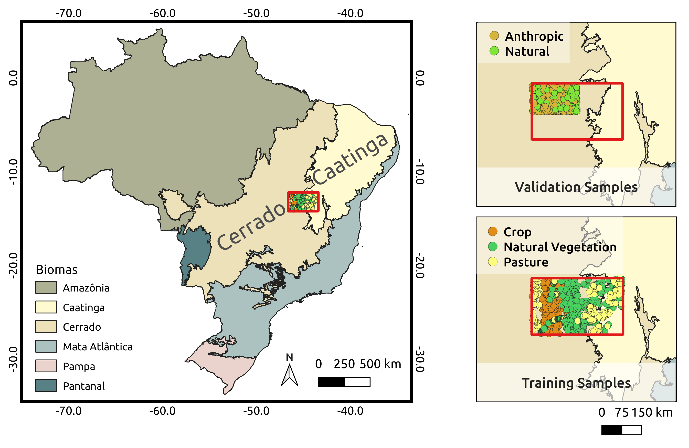

# <span style="color: #336699">Earth Observation Data Cubes for Brazil: Requirements, Methodology and Products</span>
<hr style="border:2px solid #0077b9;">

<br/>

<div style="text-align: center;font-size: 90%;">

Rolf E. O. Simões <sup><a href="mailto:rolf.simoes@inpe.br"><i class="far fa-lg fa-envelope"></i></a> <a href="https://orcid.org/0000-0003-0953-4132"><i class="fab fa-lg fa-orcid" style="color: #a6ce39"></i></a></sup>, Alber H. Sanchez <sup><a href="mailto:alber.ipia@inpe.br"><i class="far fa-lg fa-envelope"></i></a> <a href="https://orcid.org/0000-0001-7966-2880"><i class="fab fa-lg fa-orcid" style="color: #a6ce39"></i></a></sup>, Felipe M. Carlos <sup><a href="mailto:felipe.carlos@inpe.br"><i class="far fa-lg fa-envelope"></i></a> <a href="https://orcid.org/0000-0002-3334-4315"><i class="fab fa-lg fa-orcid" style="color: #a6ce39"></i></a></sup>, Leonardo S. Vieira <sup><a href="mailto:leonardo.vieira@inpe.br"><i class="far fa-lg fa-envelope"></i></a> <a href="https://orcid.org/0000-0002-3397-6232"><i class="fab fa-lg fa-orcid" style="color: #a6ce39"></i></a></sup>,<br/>

Karine R. Ferreira <sup><a href="mailto:karine.ferreira@inpe.br"><i class="far fa-lg fa-envelope"></i></a> <a href="https://orcid.org/0000-0003-2656-5504"><i class="fab fa-lg fa-orcid" style="color: #a6ce39"></i></a></sup>, Lubia Vinhas <sup><a href="mailto:lubia.vinhas@inpe.br"><i class="far fa-lg fa-envelope"></i></a> <a href="https://orcid.org/0000-0003-1104-3607"><i class="fab fa-lg fa-orcid" style="color: #a6ce39"></i></a></sup>, Gilberto R. Queiroz<sup>* <a href="mailto:gilberto.queiroz@inpe.br"><i class="far fa-lg fa-envelope"></i></a> <a href="https://orcid.org/0000-0001-7534-0219"><i class="fab fa-lg fa-orcid" style="color: #a6ce39"></i></a></sup>
    <br/><br/>
    Earth Observation and Geoinformatics Division, National Institute for Space Research (INPE)
    <br/>
    Avenida dos Astronautas, 1758, Jardim da Granja, São José dos Campos, SP 12227-010, Brazil
    <br/><br/>
    <sup>*</sup> Author to whom correspondence should be addressed.
    <br/><br/>
    February 24, 2021
</div>

<br/>

<div style="text-align: justify;  margin-left: 10%; margin-right: 10%;">
<b>Abstract.</b> This RMarkdown compendium contains useful information for the creation of land use and land cover (LULC) maps using Earth observations data cubes and machine learning (ML) techniques. The code is based on the research pipeline described in the paper <em>Earth Observation Data Cubes for Brazil: Requirements, Methodology and Products</em>. All the datasets required to the reproducibility of the work is also available. 
</div>

<br/>
<div style="text-align: justify;  margin-left: 15%; margin-right: 15%;font-size: 75%; border-style: solid; border-color: #0077b9; border-width: 1px; padding: 5px;">
<b>This RMarkdown page is supplement to the <a href="https://www.mdpi.com/2072-4292/12/24/4033/htm#sec5-remotesensing-12-04033" target="_blank">Section 5</a> of the following paper:</b>
<div style="margin-left: 10px; margin-right: 10px">
Ferreira, K.R.; Queiroz, G.R.; Vinhas, L.; Marujo, R.F.B.; Simoes, R.E.O.; Picoli, M.C.A.; Camara, G.; Cartaxo, R.; Gomes, V.C.F.; Santos, L.A.; Sanchez, A.H.; Arcanjo, J.S.; Fronza, J.G.; Noronha, C.A.; Costa, R.W.; Zaglia, M.C.; Zioti, F.; Korting, T.S.; Soares, A.R.; Chaves, M.E.D.; Fonseca, L.M.G. 2020. Earth Observation Data Cubes for Brazil: Requirements, Methodology and Products. Remote Sens. 12, no. 24: 4033. DOI: <a href="https://doi.org/10.3390/rs12244033" target="_blank">10.3390/rs12244033</a>.
</div>
</div>


### Land Use and Cover Mapping from Sentinel-2/MSI Data Cubes

This document will present the steps used to generate the Sentinel-2/MSI classification map presented in the paper. As presented in the article, the classification process was done using the [SITS R package](https://github.com/e-sensing/sits).

**Study Area and samples**

The article associated with this example of reproduction uses a region of Bahia, Brazil, between the Cerrado and Caatinga biomes, as the study area. In this example, the classification will be done using a small region within the research paper study area to reduce computational complexity.

On the other hand, the samples used will be the same ones presented in the article, with the difference that these will have the time series associated with each sample extracted again. The figure below shows the selected region for the classification and used samples.

<div align="center">
  
</div>
<br/>
<center><b>Figure 1</b> - Study area in relation to Brazil and its biomes.</center>

**Parameters**

If you want to download and run this notebook in a workflow as a script, you can perform its parameterization through the [papermill library](https://github.com/nteract/papermill). The access to the Brazil Data Cube (BDC) data products requires an access key. To request your access key, please, contact the BDC team  at brazildatacube@inpe.br. Define the `BDC_ACCESS_KEY` env variable to access to use the BDC Services.

```{r}
classification_memsize    <- 20 # in GB
classification_multicores <- 20

start_date  <- "2018-09-01"
end_date    <- "2019-08-31"
```

**Samples and ROI definition**


```{r}
# fixed parameters
collection  <- "S2_10_16D_STK-1"

# define the roi and load samples file
roi     <- readRDS(url("https://brazildatacube.dpi.inpe.br/geo-knowledge-hub/bdc-article/roi/roi.rds"))
samples <- readRDS(url("https://brazildatacube.dpi.inpe.br/geo-knowledge-hub/bdc-article/training-samples/rds/training-samples/rds/S2_10_16D_STK_1.rds"))
```

> All the results generated in this document will be saved in your user's `/home` directory, inside `out` directory

```{r}
output_dir <- paste0(path.expand('~/work'), "/bdc-article", "/results", "/S2_10_16D_STK_1")

dir.create(
    path         = output_dir,
    showWarnings = FALSE,
    recursive    = TRUE
)
```

```{r}
set.seed(777) # pseudo-randomic seed

library(sits)
library(rgdal)
```

**Generating datacube using BDC-STAC**

The classification process was done with the use of STAC. In this approach, the data cubes used for the classification are consumed directly through the STAC service. This process is useful for avoiding data movement.

Following the definitions of the article, below is the definition of the data cube used. The spectral bands `Red`, `Green`, `Blue`, `Near-Infrared (NIR)` and the vegetation indices `EVI` and `NDVI` are applied in the created cube. The temporal extension used in the research paper covers the period of `2018-09` to `2019-08`.

```{r}
cube <- sits_cube(
  type        = "BDC",
  name        = "cube_to_classify",
  url         = "https://brazildatacube.dpi.inpe.br/stac/",
  collection  = collection,
  start_date  = start_date,
  end_date    = end_date,
  roi         = roi$search_roi
)
```

**MultiLayer Perceptron model definition**

For the classification of data cubes, the article presents the use of an MLP network with five hidden layers with 512 neurons, trained with the backpropagation algorithm, using the Adam optimizer. The model uses the ReLu activation function.

Below is the definition of this model using the [SITS package](https://github.com/e-sensing/sits).

```{r}
mlp_model <- sits_deeplearning(layers        = c(512, 512, 512, 512, 512),
                               activation    = "relu",
                               optimizer     = keras::optimizer_adam(lr = 0.001),
                               epochs        = 200)
```

Below, the defined model is trained using the same samples used in the article.

```{r}
dl_model <- sits_train(samples, mlp_model)
```

**Classify the datacube**

> This is a time-consuming process

```{r}
probs <- sits_classify(data       = cube,
                       ml_model   = dl_model,
                       memsize    = classification_memsize,
                       multicores = classification_multicores,
		                   roi        = roi$classification_roi,
                       output_dir = output_dir)
```

**Generate classification label map**

```{r}
probs_smoothed <- sits_smooth(probs, type = "bayes", output_dir = output_dir)
labels         <- sits_label_classification(probs_smoothed, output_dir = output_dir)
```

**Visualizing classification map**

> The raster load in this step was generated automaticaly with `sits_label_classification` function

```{r}
gdalUtils::mosaic_rasters(c(
    paste0(output_dir, "/cube_to_classify_088097_probs_class_2018_8_2019_7_v1.tif"),
    paste0(output_dir, "/cube_to_classify_089097_probs_class_2018_8_2019_7_v1.tif"),
    paste0(output_dir, "/cube_to_classify_089098_probs_class_2018_8_2019_7_v1.tif")
), paste0(output_dir, "/cube_to_classify_merged_probs_class_2018_8_2019_7_v1.tif"))

plot(
    raster::raster(paste0(output_dir, "/cube_to_classify_merged_probs_class_2018_8_2019_7_v1.tif"))
)
```

**Save the results**

```{r}
# labels
saveRDS(
    labels, file = paste0(output_dir, "/labels.rds")
)

# probs
saveRDS(
    probs, file = paste0(output_dir, "/probs_cube.rds")
)

# smoothed probs
saveRDS(
    probs_smoothed, file = paste0(output_dir, "/probs_smoothed_cube.rds")
)
```
